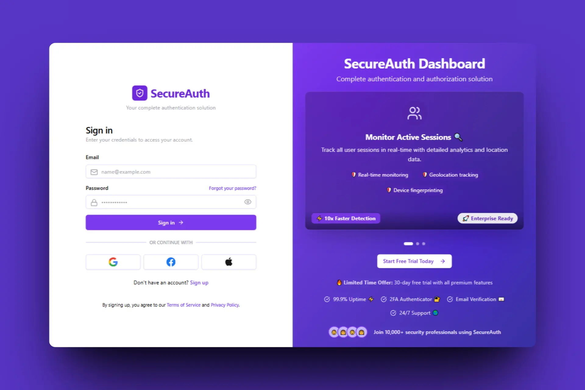

# SecureAuth: Full-Stack Authentication & User Management

<p align="center">
  
</p>

SecureAuth is a robust, full-stack application designed to provide a secure and feature-rich foundation for user authentication and management. It features a modern Next.js frontend and a powerful Express.js backend, incorporating best practices for security and user experience.

## ✨ Features

- **Secure Authentication:** JWT-based authentication flow (login, registration, token refresh).
- **Session Management:** View and manage active user sessions, with the ability to log out from specific sessions or all devices.
- **Password Management:** Secure password reset functionality (forgot password, reset password).
- **Email Verification:** Account confirmation via email.
- **Multi-Factor Authentication (MFA):** (Coming Soon) Endpoints and libraries are in place for easy integration of TOTP-based MFA.
- **User Profile Management:** Users can view and update their profile information.
- **Typed & Scalable:** Built entirely with TypeScript for a robust and maintainable codebase.
- **Responsive UI:** Modern and responsive user interface built with Next.js, Tailwind CSS, and Shadcn/ui.

## 🛠️ Tech Stack

### Backend

- **Framework:** Express.js
- **Language:** TypeScript
- **Database:** PostgreSQL
- **ORM:** Sequelize
- **Authentication:** Passport.js (jwt-strategy), JSON Web Token (JWT), bcrypt
- **MFA:** `otplib`, `speakeasy`, `qrcode`
- **Validation:** Zod
- **API Documentation:** (Implicit via routes)
- **Mailing:** Resend
- **Logging:** Winston
- **Security:** Helmet, CORS

### Frontend

- **Framework:** Next.js (with Turbopack)
- **Language:** TypeScript
- **Styling:** Tailwind CSS
- **UI Components:** Shadcn/ui
- **State Management & Data Fetching:** TanStack Query (React Query)
- **Form Handling:** React Hook Form with Zod for validation
- **HTTP Client:** Axios
- **UI/UX:** Dark Mode, Toasts/Notifications

## 📂 Project Structure

The project is structured as a monorepo with two main packages:

- `backend/`: The Express.js server, handling all API logic, database interactions, and authentication.
- `frontend/`: The Next.js client application that consumes the backend API and provides the user interface.

## 🚀 Getting Started

### Prerequisites

- [Node.js](https://nodejs.org/en/) (v18 or higher recommended)
- [npm](https://www.npmjs.com/) or [yarn](https://yarnpkg.com/)
- [PostgreSQL](https://www.postgresql.org/) database instance

### 1. Backend Setup

```bash
# Navigate to the backend directory
cd backend

# Install dependencies
npm install

# Create a .env file from the example
# (You'll need to create this file yourself and fill in the values)
# See the .env.example section below

# Run database migrations
# (Assuming you have a script for this, e.g., 'npm run db:migrate')
# You may need to configure the database connection first in config/config.json

# Start the development server
npm run dev
```

The backend server will be running on the port specified in your `.env` file (e.g., `http://localhost:3001`).

### 2. Frontend Setup

```bash
# Navigate to the frontend directory from the root
cd frontend

# Install dependencies
npm install

# Create a .env.local file
# (You'll need to create this file yourself and fill in the values)
# See the .env.example section below

# Start the development server
npm run dev
```

The frontend application will be available at `http://localhost:3000`.

## ⚙️ Environment Variables

### Backend (`backend/.env`)

```env
# Application
PORT=3001
NODE_ENV=development

# Database
DB_USER=your_db_user
DB_PASSWORD=your_db_password
DB_HOST=localhost
DB_PORT=5432
DB_NAME=secureauth

# JWT
JWT_SECRET=your_super_secret_key
JWT_EXPIRES_IN=15m
JWT_REFRESH_SECRET=your_super_secret_refresh_key
JWT_REFRESH_EXPIRES_IN=7d

# Email (Resend)
RESEND_API_KEY=your_resend_api_key
```

### Frontend (`frontend/.env.local`)

```env
NEXT_PUBLIC_API_URL=http://localhost:3001/api
```

## 🔌 API Endpoints

All endpoints are prefixed with `/api`.

| Endpoint                    | Method   | Protection | Description                                      |
| --------------------------- | -------- | ---------- | ------------------------------------------------ |
| **/auth/register**          | `POST`   | Public     | Register a new user.                             |
| **/auth/login**             | `POST`   | Public     | Log in a user and receive JWT tokens.            |
| **/auth/logout**            | `POST`   | **Private**  | Log out the current user session.                |
| **/auth/refresh**           | `GET`    | Public     | Refresh the JWT access token using a refresh token. |
| **/auth/verify/email**      | `POST`   | Public     | Verify user's email with a token.                |
| **/auth/password/forgot**   | `POST`   | Public     | Send a password reset email.                     |
| **/auth/password/reset**    | `POST`   | Public     | Reset user's password with a token.              |
| **/user/:id**               | `GET`    | **Private**  | Get user details by ID.                          |
| **/user/:id**               | `PUT`    | **Private**  | Update user details.                             |
| **/user/:id/password**      | `PUT`    | **Private**  | Update user's password.                          |
| **/sessions/**              | `GET`    | **Private**  | Get all active sessions for the current user.    |
| **/sessions/history**       | `GET`    | **Private**  | Get login history for the current user.          |
| **/sessions/history/delete**| `DELETE` | **Private**  | Clear login history for the current user.        |
| **/sessions/:sessionId**    | `GET`    | **Private**  | Get specific session details.                    |
| **/sessions/logout**        | `POST`   | **Private**  | Log out from a specific session.                 |
| **/sessions/logout-all**    | `POST`   | **Private**  | Log out from all sessions.                       |

## 📄 License

This project is licensed under the **MIT License**. See the `LICENSE` file for more details.

---